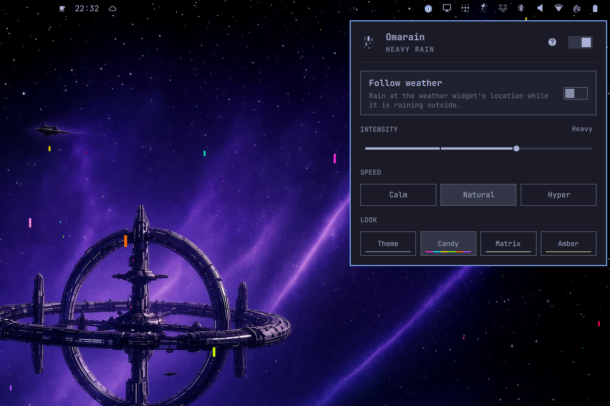

# Omarain

Omarain is a quiet wallpaper overlay for Omarchy. Small squares fall in front of the current background and kick a few specks sideways when they hit the bottom edge. Most drops are the theme foreground at two opacities; a thinner slice uses the accent, the same way the screensaver throws a few brighter glyphs through a TTE rain.


It sits on Hyprland’s bottom layer, so windows and the bar stay above it. The surface does not take clicks. Double-clicking the desktop still opens the wallpaper picker.

If the machine exposes an accelerometer (IIO or Apple SMC `position`), tilting the chassis leans the rain.

Left-click the bar icon to open the panel. The switch turns rain off and on, restoring the last mode. Follow weather rains at the weather widget's location while it is raining outside, with volume from Open-Meteo. Intensity is Light, Steady, Heavy, or Torrential, and the slider hides while Follow weather is on. Speed is Calm, Natural, or Hyper-gravity. Look is Theme, Candy, Matrix, or Amber. Candy is a mixed neon field. Matrix can fall as glyphs instead of pixels. Right-click the icon to turn rain off and on without opening the panel.



## Install

```bash
omarchy plugin add https://github.com/vincentritter/omarchy-omarain.git --enable
```

That lands in `~/.config/omarchy/plugins/vincentritter.omarain`. Omarain complements [Tinytray](https://github.com/vincentritter/omarchy-tinytray): rain on the wallpaper, widgets in the drawer. Host it there, or leave it on the right of the bar. Disable with `omarchy plugin disable vincentritter.omarain`. Remove with `omarchy plugin remove vincentritter.omarain`.

## Tests

```bash
node --test RainModel.test.js
```
